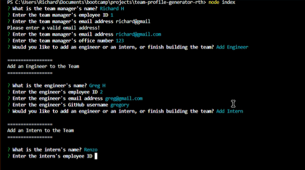

# Team Profile Generator
## Description

This program makes it easy to generate a simple webpage listing members of a professional team consisting of 1 manager and several engineers and interns.

## Table of Contents

- [Installation](#installation)
- [Usage](#usage)
- [License](#license)
- [Contributing](#contributing)
- [Tests](#tests)
- [Questions](#questions)

## Installation

1. Make sure you have downloaded and installed [node.js](https://nodejs.org/en/download/)
2. Download a .zip of this repository, or clone the repository into a new directory using Git.
3. Open a terminal window in the location of the extracted or cloned files and run ```node install``` to ensure the necessary packages will be included. You should see a new folder called "node_modules" appear in the directory.

## Usage

1. Type ```node index``` into your command line shell and press Enter to run Team Profile Generator.
2. Answer the prompts in the terminal window.
3. Your newly generated index.html file will appear in the "dist" folder inside your directory.

Watch a brief video demonstrating usage:

[](https://drive.google.com/file/d/16B0osNheF6ecnbchqlOPha2WKMVB9t76/view)

## License

[](https://opensource.org/licenses/MIT)

## Contributing

Professional readme template generated using [https://github.com/chardmuffin/readme-generator-rth](https://github.com/chardmuffin/readme-generator-rth)

## Tests

Tests are ran using Jest. Install jest using ```npm install jest --save-dev``` and then enter ```npm test``` to run the 4 tests:
* Employee.test.js
* Engineer.test.js
* Intern.test.js
* Manager.test.js

The tests ensure that these 4 objects are created via contructor and contain the proper attributes.

## Questions

I am on GitHub: [https://github.com/chardmuffin](https://github.com/chardmuffin)

I can also be reached by email at [richardhuffman96@gmail.com](mailto:richardhuffman96@gmail.com)